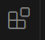
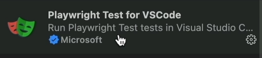
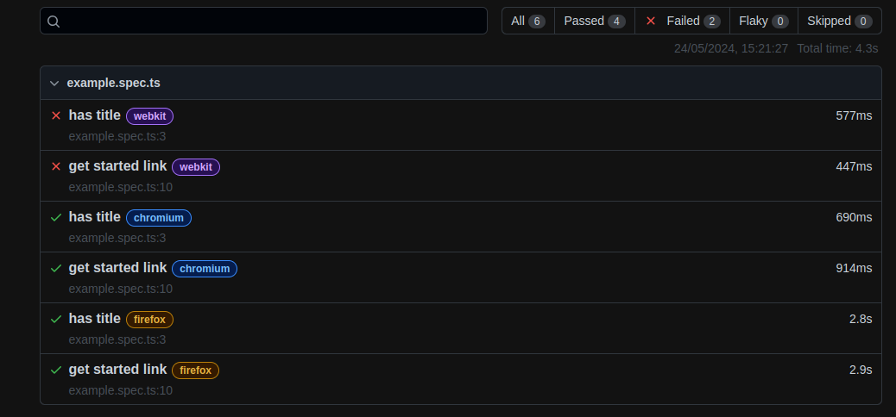
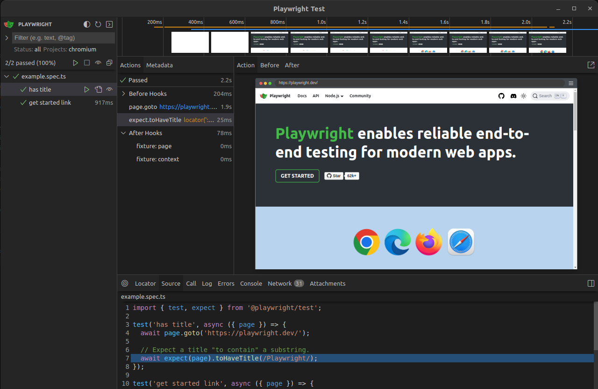
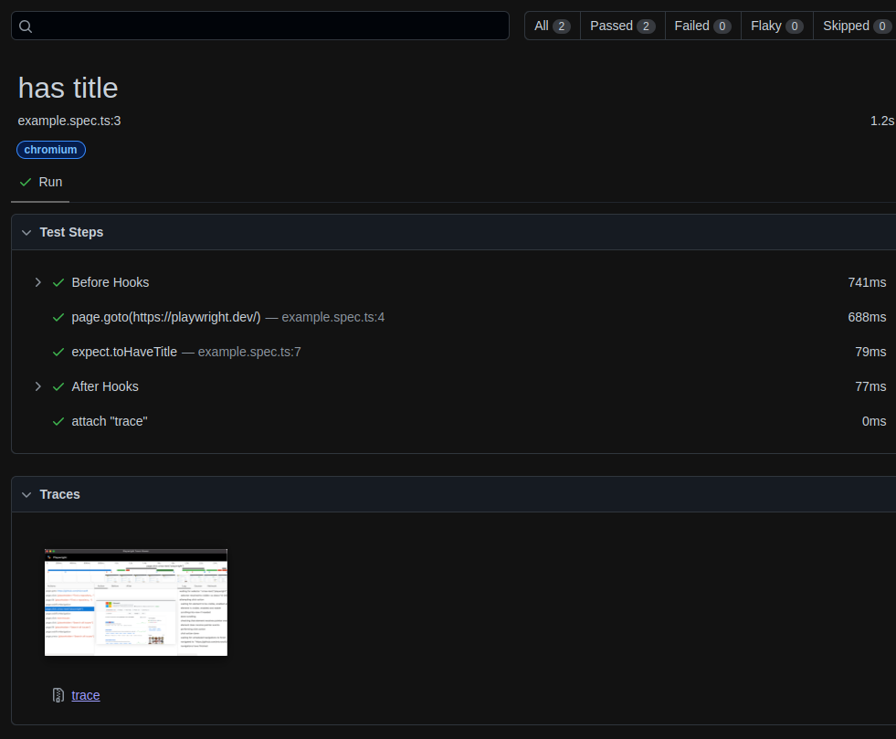

# Test UI with Playwright (for beginner)

1. [Pre-requisites](#pre-requisites)
2. [Configure](#configure)
3. [Execute tests](#execute-tests)
4. [Test execution with UI](#test-execution-with-ui)
5. [Trace](#trace)

## Pre-requisites
- **[git](https://git-scm.com/book/en/v2/Getting-Started-Installing-Git)** to retrieve source code
- **[nodejs](https://nodejs.org/en)** 

## Configure

### pnpm install

```sh
pnpm install

pnpm exec playwright install --with-deps
```

### VSCode Playwright extension
Open VSCode and click on 'Extensions' button

Then searche for playwright and the very first thing which has a check mark of Microsoft wiich is official plugin of th Microsoft. You will need to click the button install.




### Playwright installation (new projetct)
Create a new test project and open it in VSCode.

Open a new terminal session and execute command:

```sh
pnpm create playwright
```

## Execute tests
In a terminal, execute command (e2e directory):
```sh
npx playwright test

or

pnpm exec playwright test
```

Open report as HTML page, execute command:
```sh
npx playwright show-report
```


Tests headed. During the execution, playwright run a browser
```sh
npx playwright test --project=chromium --headed
```

## Test execution with UI

### Playwright UI

In a terminal, execute command:
```sh
npx playwright test --ui
```


## Trace

By default, trace is configured 'on-first-retry: if the test failed for the first time on the first retry when playwright tried to rerun failed test, it will automatically generate a trace and attach to the report.

Trace 'on' always create a trace for each every test even those that are successful execution.

```sh
npx playwright test --project=chromium --trace on

#To open last HTML report run:

npx playwright show-report
```



This looks like a normal report. If we open the report, there is a **traces** section.
Click on the trace, so we have all the steps that were performed like Playwright UI runner.

> Note!
> Run CI server, having this trace on is very useful to analyze the test.
